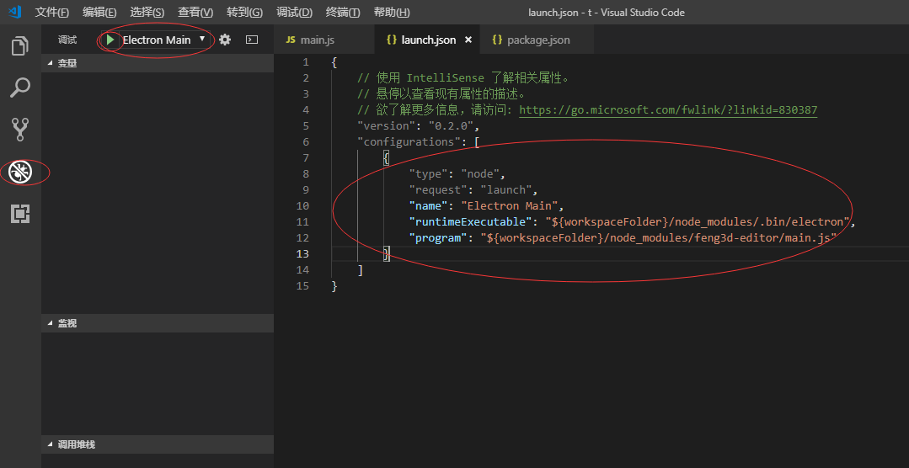

# editor
feng3d引擎编辑器

## 文档
    http://feng3d.com

## Issues
    https://github.com/feng3d-labs/editor/issues

## 在线版本
    http://feng3d.com/editor/index.html

## 本地版本
    https://github.com/feng3d-labs/editor/releases

## 使用npm安装
```
npm install feng3d-editor
```
### 运行项目

在 launch.json 中添加一下配置，选择 Electron Main 执行。
```
{
    "type": "node",
    "request": "launch",
    "name": "Electron Main",
    "runtimeExecutable": "${workspaceFolder}/node_modules/.bin/electron",
    "program": "${workspaceFolder}/node_modules/feng3d-editor/main.js"
}
```


## 交流
QQ群：519732759